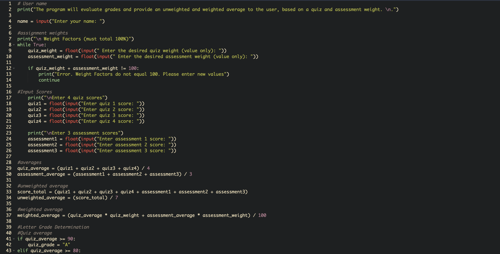
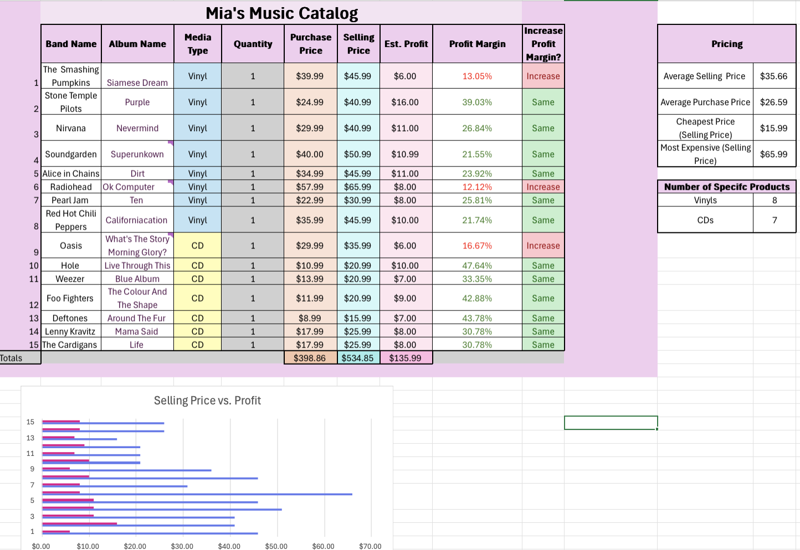
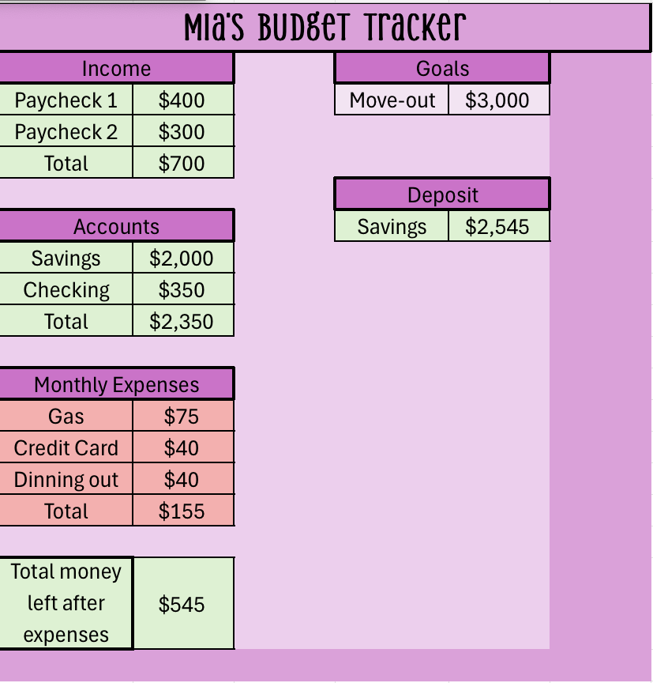

# Mia Meyers
Contact Info: memeyers@loyola.edu
memeyers156@gmail.com

### About Me 
Hello! I am an experienced Psychologist with over 7 years of proven expertise in psychological diagnosis through counseling. 

With skills like critical thinking, problem solving, and communication I am able to diagnose and treat teenagers, young adults, adults, and couples. I am adept at using SPSS, Microsoft 365 Ecosystem, Excel, and Python. 

My extensive skill set, commitment to understanding my clients and a passion for their quality of mental health makes me a valuable asset. In my spare time I like to read books and spend time with those close to me. 

You can find me at **[LinkdeIn](www.linkedin.com/in mia-meyers-4973a6393)**

### Education 
Loyola University Maryland, Psychology B.A. 
### Projects

#### Grade Calculator
 - **Summary:** This Grade Calculator which was using Python coding in the Jdoodle software provides unweighted and weighted averages based on quiz and assessment weights.

 

 - **Initial project idea:** This project was created to figure out what my grade would be based on the weight and grade that I got on certain assignments in my courses. Sometimes it is difficult to figure out your overall grade when all you have are assignments and their weights. This project can help to provide the user with their overall grade for a course and its use of individual assignment grades could help the user find out what they need to improve on.

 - **Tools I used:** To complete this project I used the Python coding language on a website called Jdoodle

 - **Challenges I faced:** Adapting to the meticulous nature of coding was a big challenge when completing this project. It is very easy to make an error when coding and those errors will affect all of the code. Being intentional and diligent with all of the intricacies of coding was the key to overcoming this. I made sure to check every piece of new code that I typed so that I could avoid issues later on. 

 - **Other Resources:** I asked my friends to input their own grades and assignments weights to make sure the results were seamless. 

 - **Result:** By the end of my project, I was able to successfully create a grade calculator that produced your final grade average both weighted and unweighted while also providing the letter grade. One thing I would try to improve on in the future is making the code less diluted and complicated. I think on some parts I put more content than I needed. 

 Link to project: **[Grade Calculator](https://www.jdoodle.com/ia/1O3i)**
 
***
#### Inventory Manager
 - **Summary:** This inventory manager is through and Microsoft Excel. It logs all of the information regarding the costs and characteristics of certain items that a business would sell. 

 - **Initial project idea:** This project helps to keep track of the inventory of a business which could be a side hustle. If you would have a side hustle you would need to keep trac k of your items and the profit.  The problem I set out to solve with this project was if I should increase the profit margin for the items or not. The excel equations I inserted determined this for me so that I could know how to operate my business in the most efficient and successful way. 

 - **Tools I used:** I used Microsoft Excel

 - **Challenges I faced:** During this project I had to learn how to use some more complex functions which was challenging. Once I figured out how to type the equations correctly the whole project flowed. 

 - **Other Resources:** I did not use any other resources

 - **Result:**  This project allowed for me to learn more about the inner workings of a business and helped me be more organized. To improve this, I would try to add more columns to provide more depth into the business model.

 Linkt to Project: **[Inventory Manager](https://studentsloyola-my.sharepoint.com/:x:/r/personal/memeyers_loyola_edu/_layouts/15/doc2.aspx?sourcedoc=%7BB9939BE1-10E9-42DB-AF91-BBB2ED861FA8%7D&file=Inventory%20Manager.xlsx&action=default&mobileredirect=true&DefaultItemOpen=1&wdOrigin=APPHOME-WEB.DIRECT%2CAPPHOME-WEB.JUMPBACKIN&wdPreviousSession=7bc3fb08-b99c-47bf-b367-3e5e139485e8&wdPreviousSessionSrc=AppHomeWeb&ct=1765207438293)**
 
***
#### Budget Tracker
 - **Summary:** This project is a Budget tracker that uses your income and the money you have saved as well as your personal costs. This helps give perspective to your spending and what it is on. 

 - **Initial project idea:** This project tracks spending and income so that you can successfully budget and use your money in an efficient way. This solves the problem of overspending or being irresponsible with what purchases you prioritize. 

 - **Tools I used:** I used Microsoft Excel

 - **Challenges I faced:** In this project all of the sections had to connect to create a total. This was difficult to figure out at first, but after being diligent and observant I formulated the correct equations.

 - **Other Resources:** I did not use other resources for this project.

 - **Result:** This budget tracker helps the user to achieve responsible and efficient spending and saving. By adding functions that change as the user inserts different amounts it is very user friendly to operate and has a simple design. To improve it I would add more sections for spending and saving for specific things.

 Link to project: **[Budget Tracker](https://studentsloyola-my.sharepoint.com/:x:/r/personal/memeyers_loyola_edu/_layouts/15/doc2.aspx?sourcedoc=%7BB9939BE1-10E9-42DB-AF91-BBB2ED861FA8%7D&file=Inventory%20Manager.xlsx&action=default&mobileredirect=true&DefaultItemOpen=1&wdOrigin=APPHOME-WEB.DIRECT%2CAPPHOME-WEB.JUMPBACKIN&wdPreviousSession=7bc3fb08-b99c-47bf-b367-3e5e139485e8&wdPreviousSessionSrc=AppHomeWeb&ct=1765207438293)**
 